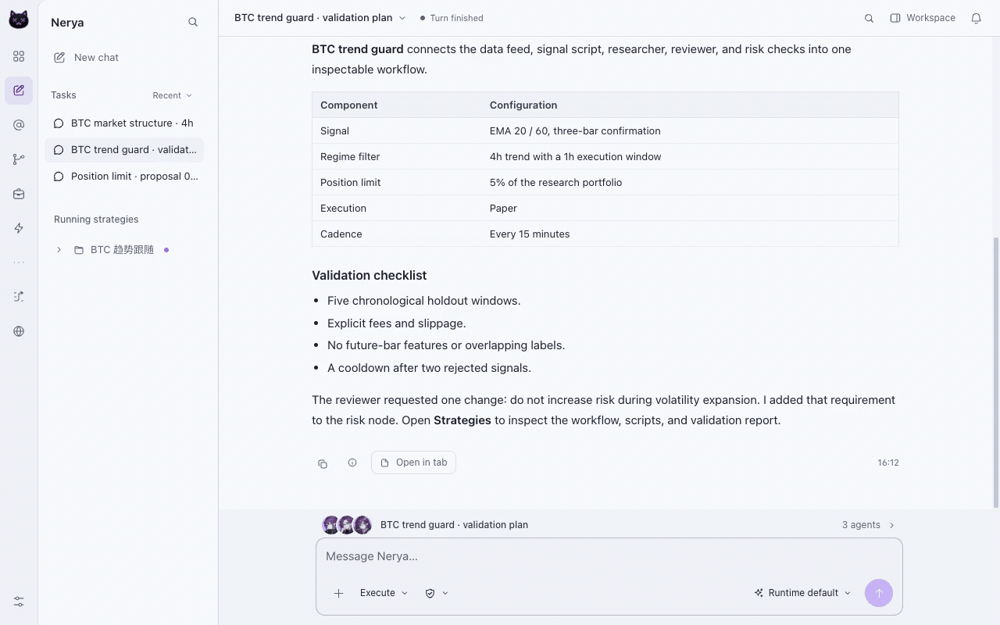

<div align="center">


# Nerya

### One idea. A team to build it.

Your local Agent strategy workspace — research, build, backtest and review in one conversation.

**1.0.0 Beta** · `1.0.0-beta.1`

[English](README.md) · [简体中文](README.zh-CN.md)

[Website](https://neryaai.github.io/) · [Documentation](https://neryaai.github.io/docs.html) · [Desktop downloads](https://github.com/NeryaAI/Nerya/releases) · [Build status](https://github.com/NeryaAI/Nerya/actions/workflows/desktop.yml)

[](https://github.com/NeryaAI/Nerya/actions/workflows/desktop.yml)
[](VERSION)
[](LICENSE)

</div>

Describe your trading idea and its constraints. Nerya brings researchers, strategy authors and reviewers into the same workspace. Follow the tools as they run, inspect the evidence, open the strategy and backtest details, and decide what happens next.

<picture>
  <source media="(prefers-color-scheme: dark)" srcset="branding/screenshots/1.0.0-beta/strategy-en-dark.gif" />
  
</picture>

*Recorded from the website's isolated product tour. It uses example data, not a live account or verified investment performance. [Recording provenance](branding/screenshots/1.0.0-beta/README.md).*

## From idea to a traceable workflow

**Build a strategy.** Describe the market, entry and exit logic, time horizon and constraints. Agents prepare the strategy package and validate it. Script strategies, script-driven Agent strategies and event-driven Agent strategies share the workspace, with readable workflow nodes, parameters and run history.

**Research as a team.** Delegate market data, news and technical research to specialized Agents. A reviewer can challenge assumptions while the lead combines the evidence. Open source material and research reports without losing the conversation.

**Inspect more than a text reply.** Strategy cards, backtest curves, market charts and research reports are part of the conversation. Open their details in workspace tabs. Backtest views include available candle history, entry/exit markers, protection levels, trades and execution evidence; missing data remains visible rather than being presented as a complete result.

**Review and iterate.** Inspect a particular run and its logs before changing a strategy. Optional review schedules produce evidence-linked recommendations and candidate changes. Review and trading authorization are distinct from editing ordinary Skill or Agent resources: those resources can be edited and saved directly.

**Keep the workspace local.** Strategies, cached market history, reports and configuration live in your workspace. Credentials are stored encrypted in the local Vault and referenced by identifier. Configured model providers, market services and external tools still receive the requests needed to perform your tasks; local storage does not make those services offline.

## What is in 1.0.0 Beta?

| Area | In the workspace |
| --- | --- |
| Agent conversation | Streaming replies, available thinking output, tool execution, progress, follow-up messages and recoverable errors |
| Strategies | Script and Agent execution, timer/event workflow nodes, strategy editing, import/export and run details |
| Backtesting | Reusable local historical data, preflight checks, coverage information, per-market charts and trade records |
| Research | Market cards, technical charts, evidence-linked reports and multi-Agent research |
| Skills & Agents | `SKILL.md` playbooks, lazy-loaded references, reusable scripts and direct resource editing |
| Integrations | Configurable model providers, exchange/wallet connections, MCP and external Agent access |
| Desktop | Tauri host with bundled Python, Node, the web workspace and Chromium; native build pipelines for three operating systems |
| Interface | English/Chinese, light/dark themes, workspace tabs and settings-based account/model configuration |

Research categories and execution support are not interchangeable. Crypto exchanges use the configured connectors; wallet and prediction-market operations depend on the relevant provider and credentials. Futures and A-share research examples do not imply that every broker, order type or instrument is executable.

## Install the desktop app

Choose a **completed release** on [GitHub Releases](https://github.com/NeryaAI/Nerya/releases), then download the installer matching your operating system and CPU.

| Platform | Architecture | Release files |
| --- | --- | --- |
| macOS | Apple Silicon / ARM64 | `.dmg`, `.pkg` |
| macOS | Intel / x64 | `.dmg`, `.pkg` |
| Windows | x64 | NSIS `.exe`, Windows Installer `.msi` |
| Linux | x64 | `.deb`, `.AppImage` |

Desktop installers contain the application's Python and Node runtimes, web server and browser engine. You do not need to install a development toolchain to use them. Windows installers include the offline WebView2 installer. Linux still depends on distribution-provided desktop/browser libraries; the build baseline is Ubuntu 22.04. See [desktop installation and build notes](desktop/README.md).

The beta pipeline uses an ad-hoc macOS signature and unsigned Windows packages unless a separate signing process is supplied. These are **not** notarized Apple Developer ID releases or Windows reputation-approved installers. Follow your organization's security policy; do not disable OS security protections to install an untrusted build.

On first launch, configure a model, add an account when needed, and configure the administrator password for external access. New workspaces contain **no default strategies or scheduled trades**. The account, model and access settings remain available afterward in Settings. Upgrades do not silently erase an existing workspace.

## Try a first task

> Research BTC/USDT using the available historical data. Build a script strategy with explicit entry and exit rules, validate it, and run a historical backtest. Show the strategy workflow, data coverage and trade details. Do not start live trading.

Or ask for a research-only result:

> Compare BTC and ETH market conditions. Split the research between price action and news, cite the evidence, and produce a report with market charts. Explain any missing data.

Model access and market-data availability depend on your configured services. A backtest is historical simulation, not a promise of future performance. Inspect the strategy code, parameters, coverage, fees and trading permissions before execution.

## Run from source

The source workflow is for developers and server deployments. Use the Node and Python versions pinned in `.node-version` and `.python-version`.

```bash
git clone https://github.com/NeryaAI/Nerya.git
cd Nerya
uv venv
uv pip install -e ".[dev,mcp,trading,prediction,browser]"
npm ci
npm --prefix desktop ci
```

For desktop development:

```bash
npm --prefix desktop run dev
```

The desktop launcher manages its local services. A source build additionally requires Rust and the platform's native build dependencies. For a web-only deployment, use the existing [CLI and MCP guide](MCP.md) and `nerya --help`; the web dashboard remains independent of Tauri.

## Build, verify and release

```bash
python scripts/release_version.py
npm run typecheck --workspace @nerya/dashboard
npm run check:i18n --workspace @nerya/dashboard
python -m unittest discover -s desktop/tests -v
npm --prefix desktop run build
python desktop/scripts/verify_runtime.py
python desktop/scripts/smoke.py --access-port 0
```

Run Python commands in the project virtual environment. macOS additionally provides `node desktop/scripts/installer.mjs` after building the app. [The desktop guide](desktop/README.md) contains exact native bundle commands and installer-payload checks.

The [desktop workflow](.github/workflows/desktop.yml) builds on Windows, Linux, Apple Silicon macOS and Intel macOS separately. It checks version consistency, locked dependencies, frontend types, Python distribution contents, desktop unit tests and the packaged runtime. Installer payload smoke tests use temporary workspaces and fake credentials, without calling a model or placing a trade. A build is not considered verified merely because the Rust compiler exits successfully.

Push a tag matching `VERSION` (for example `v1.0.0-beta.1`) to request a release. Only after the required workflow jobs succeed does the release job publish the installers, SHA-256 checksums and build metadata. Normal pushes and pull requests build artifacts but do not publish a release. Native notification prompts, OS trust dialogs and broker-specific live execution still require their own acceptance testing.

## Project layout

```text
nerya/              Python Agent runtime, APIs, connectors and trading services
nerya/skills/       Built-in SKILL.md playbooks, references and executable helpers
nerya/sdk/          Runtime strategy, trading and trigger APIs
sdk/               Python and TypeScript client SDKs
dashboard/         Next.js conversation and strategy workspace
desktop/           Tauri shell, portable runtime packaging and native smoke tests
tests/             Runtime regression tests
.github/workflows/ Validation, native desktop builds and release publication
```

## Optional local face analysis

Install `pip install "nerya[face]"` (CPU/Apple Silicon) or
`pip install "nerya[face-gpu]"` (NVIDIA CUDA) to enable the built-in
[face-analysis Skill](nerya/skills/builtin/face-analysis/SKILL.md).
It uses UniFace for face detection, alignment landmarks and two-photo cosine
similarity, with selectable SCRFD/RetinaFace/YOLOv8-Face and ArcFace/AdaFace.
Models load and download only on explicit use. Images and embeddings are not
persisted by the helper. Matches are advisory and do not establish identity,
liveness or trading authorization. See the Skill for requests and limitations.

The dashboard also offers opt-in **administrator login face verification** under
Settings → Access and security. Set the administrator password first, then enroll
the shared administrator reference using the camera. Login then requires a live
camera face check before entering the password. Its server-issued receipt lasts
120 seconds and is consumed once, including on an incorrect-password attempt.
Trading approvals and risk checks continue normally without additional face scans.
Existing local-login exemptions and API tokens retain their existing behavior.

Reference features are encrypted in a separate `face.enc` vault; original camera
frames are not saved. Removing the reference disables login face verification.
UniFace MiniFASNet provides passive anti-spoofing, not replay-proof authentication;
evaluate recognition thresholds and presentation-attack resistance before use.
For demo machines run the one-command bootstrap instead: it creates `.venv-face`,
installs the vision stack and seeds the model cache from `models/uniface/` (committed,
so nothing downloads at demo time even offline), then smoke-tests both workers:

```bash
python scripts/setup_vision_stack.py
```

The nod detector runs as a camera-scoped warm worker: the model loads when the
camera opens and is released when it closes (plus a 180 s idle safety net), so
repeated nod captures cost ~0.5 s each instead of reloading the model every time.
For an isolated inference environment, set `NERYA_FACE_PYTHON` to a Python
executable with `uniface[cpu]` installed.

## GWDC 2026 disclosure and evidence

Per the track rules, this section separates work built **before** the event from work built **during** it.

**Pre-existing (built before the event):** strategy authoring/backtest pipeline, evidence vault and its store contracts (`nerya/evidence/store.py`, `nerya/evidence/visual.py` data contract), approval/risk gates (`ApprovalGate`, `RiskGate`), gateway and account surfaces, the encrypted face-enrollment login stack, and the visual-evidence store/page scaffold.

**During the event:** the visual-evidence workbench surface wiring (route/client/page transport, sidebar entry) — [PR #6](https://github.com/NeryaAI/Nerya/pull/6), [PR #11](https://github.com/NeryaAI/Nerya/pull/11); nod-intent detection for approval cards (camera burst → single-use receipt bound to the exact approval content digest; consumed by `/approvals/callback`; `RiskGate` untouched) — PR #6; demo bootstrap password (`1145141919810`, active only until an operator sets their own password) — PR #6; local-access correction and model-loading fixes — PR #6; hard-rejection demo evidence (`tests/test_hard_rejection_demo.py`): a cap-violating request is rejected before any approval card exists, a captured nod receipt cannot be re-attached to it, and the resume-time re-check still refuses — the executor is unreachable for such a request; Kiln usage evidence exporter (`scripts/export_kiln_usage.py`).

**Honest capability statement:** the nod detector expresses confirmation intent only — it is not identity verification, not liveness/anti-spoofing, and never bypasses risk or approval gates. Face features stay local; no biometric data leaves the machine.

### Proof of API usage

Two hard track requirements, both wired one-command:

**1. Kiln — HTTP calls to the NPU LLM `gpt-oss-120b`.** Kiln exposes an OpenAI-compatible API (`https://api.bricksum.com/v1`). Store the `sk-bk-...` key and switch every LLM tier to Kiln in one command, then re-run the demo flows so the journals contain real Kiln calls:

```bash
python scripts/setup_gwdc_infra.py kiln --workspace <workspace-root> --api-key sk-bk-...
# restart `nerya serve`, run the flows, then:
python scripts/export_kiln_usage.py --workspace <workspace-root>
```

**2. Blockchain — testnet contract/decision anchoring with `tx_hash`.** Generate a Sepolia signer into the encrypted vault, fund it from a faucet, and anchor persisted risk decisions (32-byte evidence-claim hash, self-addressed tx on Sepolia):

```bash
python scripts/setup_gwdc_infra.py chain-key --workspace <workspace-root>      # prints address
python scripts/setup_gwdc_infra.py chain-check --workspace <workspace-root>    # chainId + balance probe
python -m nerya.cli.app chain-evidence anchor --workspace <workspace-root>   --strategy-id <id> --session-id <id> --chain sepolia   --signer-ref vault://chain_audit_sepolia_team3
python scripts/export_kiln_usage.py --workspace <workspace-root>               # tx hashes surface here
```

Paste the exporter output below and annotate each row with the demo flow it backs. (Team 3: fill in Kiln call rows and tx hashes before submitting.)

### Demo notes

- A fresh install signs in with the bootstrap password `1145141919810`; setting an operator password in Settings → Login & access disables it immediately. It is committed on purpose for a zero-setup demo — change it before any real use.
- Visual-evidence demo samples live in `docs/demo-samples/` (normal / unit-ambiguous / blurred-cropped).

## Security and licensing

Live execution requires the corresponding configuration and authorization; do not bypass the trading risk and approval gates. Vault encryption protects stored credentials, not a compromised running process. Keep backups of your workspace and its encryption key, and never commit account secrets, `.env` files or live trading state.

Nerya is licensed under [PolyForm Noncommercial 1.0.0](LICENSE). Commercial use requires a separate license. Bundled third-party components retain their own licenses. This beta is software for research and strategy operations, not investment advice or a guarantee against financial loss.
